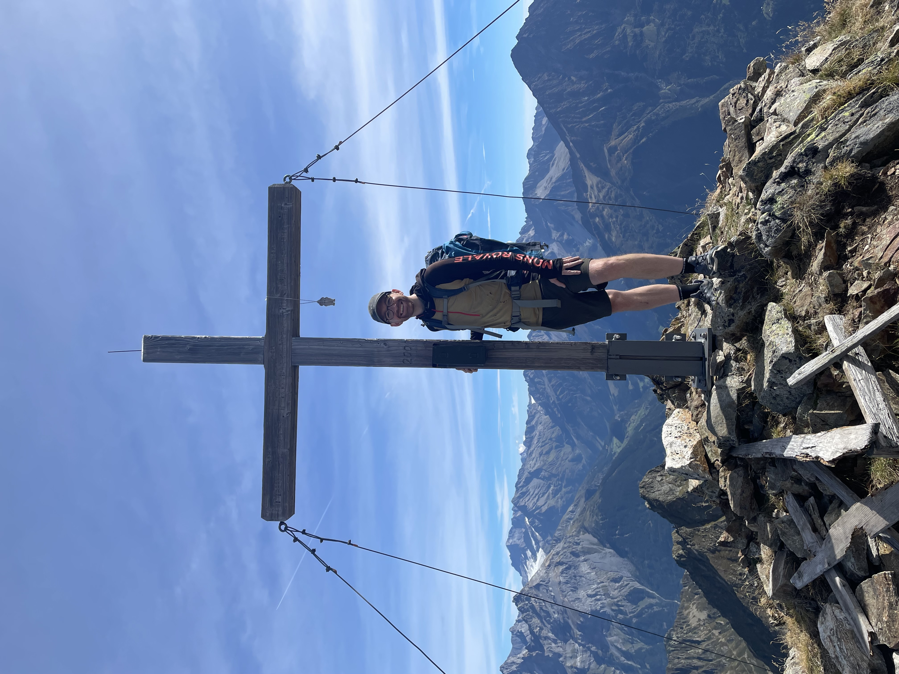

# About Me

::::: {style="display: flex; justify-content: center;"}
:::: {.hover-reveal style="width: 500px;"}

::: tint-overlay
:::
::::
:::::

I’m a medical doctor by training, but it didn’t take me long to figure out that my heart beats for research. Today, I’m a professor of medical data science and brain research at the University of Bern.

I’ve also spent several years abroad for research fellowships, including in Washington, DC, USA, and Stockholm, Sweden. Living and working in different countries, cultures and research environments has shaped how I think about science, people and the world more broadly.

A major focus of my work is a question that has bothered me for years: why do so many findings from animal experiments fail to translate to humans, and how can we improve that while reducing animal testing?

I worked in animal research myself for many years, doing experiments with mice, rats and monkeys, some of them severe. I saw how much these animals suffered, contrasting with the relatively little benefit that many animal experiments ultimately bring. [Check out this paper](https://journals.plos.org/plosbiology/article?id=10.1371/journal.pbio.3002667).

I think some animal research is still necessary these days, unfortunately. But I am also increasingly infuriated by how much animal suffering and research waste we continue to accept for so little gain. We can, and must, do MUCH better: fewer unnecessary experiments, less harm, better research, and ultimately more benefit from every animal used. [Read more here](https://link.springer.com/article/10.1186/s12967-026-08259-y).

My group now studies these questions mostly using large-scale evidence synthesis, medical data and computational methods. We try to understand which findings from animal research translate to humans, which do not, and why. [Read more about the STRIDE-Lab and the DCR Medical Data Science Group](https://dcr.unibe.ch/about_us/team/medical_data_science_unit/index_eng.html).

I hope for a world in which coming generations eventually make animal experiments unnecessary.

Mentoring younger researchers is also something I care about a lot. Good mentors and role models were instrumental in my own development, and I try to pass that on by supporting younger scientists in finding their own path.

I’m also very interested in psychedelic research and their responsible use. I think psychedelics can make an important positive contribution to how we understand ourselves, our minds, and our place in the world and universe. Used carefully and in the right context, they may also help foster a more compassionate society and shift attention towards the things that actually matter.

More broadly, my worldview has been influenced by Albert Hofmann’s idea that science offers one powerful perspective on reality, but not necessarily a complete one. I say this as a neuroscientist and a strong believer in science: there may be aspects of our experience, consciousness and perhaps the universe itself that are not accessible to scientific measurement. I don’t see this as a rejection of science, but as an acknowledgement of its boundaries—and a reason to remain curious about what may lie beyond them.
