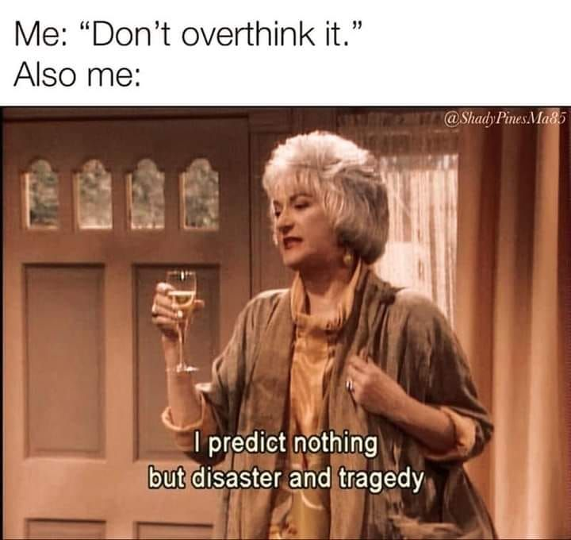
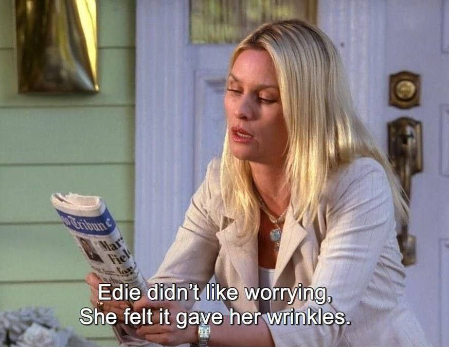

# Unsinn

Ich habe eine Schwäche für absurden – und manchmal auch etwas unangebrachten – Humor. Monty Python, die früheren Bücher von Walter Moers, Terry Pratchett, Douglas Adams und Marc-Uwe Klings Känguru-Bücher gehören zu meinen Favoriten.

Hier sind ein paar Dinge, die ich lustig finde.

"And the Lord spake, saying, 'First shalt thou take out the Holy Pin. Then, shalt thou count to three, no more, no less. Three shalt be the number thou shalt count, and the number of the counting shalt be three. Four shalt thou not count, nor either count thou two, excepting that thou then proceed to three. Five is right out. Once the number three, being the third number, be reached, then lobbest thou thy Holy Hand Grenade of Antioch towards thou foe, who being naughty in my sight, shall snuff it.'" - Monty Python, the Holy Grail\
“What is your favourite colour?” — Bridgekeeper\
“Blue. No, yell— AAAAAAAARGH!”

„Mein, dein … das sind doch bürgerliche Kategorien.“\
— Das Känguru

„Lieber fünf Mal nachgefragt als ein Mal nachgedacht.“\
— Marc-Uwe, Die Känguru-Chroniken

"Aber Obacht", sagt das Känguru, "das liest sich positiver, als es gemeint ist. Die benutzen da immer so 'nen Kapitalistengeheimcode.

Die Frau liest laut vor:\
"Das Känguru war bei seiner Arbeit immer unkreativ, unpünktlich, unflexibel, desinteressiert, nicht belastbar, kaum teamfähig, schwer zu begeistern und unkreativ. Vorgesetzten gegenüber war es unfähig, sich unterzuordnen, vulgär, obszön und gelegentlich handgreiflich. Vom Tacker bis zum Flachbildschirm waren alle ihm zugeteilten Arbeitsgeräte innerhalb von Stunden nicht mehr auffindbar. Schon am zweiten Arbeitstag versuchte es mit einigem Erfolg, einen Generalstreik zu organisieren. Die Firma sah sich gezwungen, nach neun Tagen eine fristlose Kündigung auszusprechen, zu diesem Zeitpunkt war das Känguru allerdings schon mehrere Tage nicht mehr an seinem Arbeitsplatz erschienen.

Die Zustellung der Kündigung erwies sich aus diesem Grund und auch wegen der falsch angegebenen Adresse als schwierig. Auf die Einstellung der Gehaltszahlung reagierte das Känguru mit einer Klage vor dem Arbeitsgericht. Mehrfach bezeichnete es in dem darauf folgenden Prozess seine Vorgesetzten und die Gerichtsdiener als verdammte Faschisten. Auch fragte es den Richter, ob er nicht mitbekommen habe, dass sich einige Gesetze seit den 40er Jahren geändert hätten. Nach verlorenem Prozess drohte es damit, dreckige Firmengeheimnisse zu veröffentlichen. Obwohl der Firmenleitung unklar war, von welchen dreckigen Geheimnissen das Känguru sprach, wurde es sicherheitshalber wieder eingestellt und ist seitdem nie wieder am Arbeitsplatz erschienen. Teile der Belegschaft sind bis zum heutigen Tag immer noch aufmüpfig und ungehorsam."

Die Frau lässt das Zeugnis sinken.

"Und was liest sich positiver als es gemeint ist?", fragt sie.

"Nächster Satz", sagt das Känguru.

Sie liest: "In den fünf Tagen, die es tatsächlich immer bei uns gearbeitet hat, hatte es allerdings durch seine Geselligkeit zur Verbesserung des Betriebsklimas beigetragen."

"Hä?", frage ich verwundert.

"Das ist ein Code für übertriebenen Alkoholkonsum", sagt die Frau.

— Das Känguru

:::: {.hover-reveal style="width: 500px;"}

::: tint-overlay
:::
::::

------------------------------------------------------------------------

::: {style="text-align: center;"}
*"You miss 100% of the shots you don't take - Wayne Gretzky"*\
— Micheal Scott, Scranton PA
:::

------------------------------------------------------------------------

:::: {.hover-reveal style="width: 500px;"}

::: tint-overlay
:::
::::

 

:::: {.hover-reveal style="width: 500px;"}

::: tint-overlay
:::
::::

------------------------------------------------------------------------

::: {style="text-align: center;"}
*"Treat yo self!"*\
— Tom Havenford and Donna Meagle
:::

------------------------------------------------------------------------

:::: {.hover-reveal style="width: 500px;"}

::: tint-overlay
:::
::::

 

:::: {.hover-reveal style="width: 500px;"}

::: tint-overlay
:::
::::

------------------------------------------------------------------------

::: {style="text-align: center;"}
*"It's fine! The doctor said all my bleeding was internal. That's where the blood's supposed to be."*\
— Jake Peralta
:::

------------------------------------------------------------------------

:::: {.hover-reveal style="width: 500px;"}

::: tint-overlay
:::
::::
