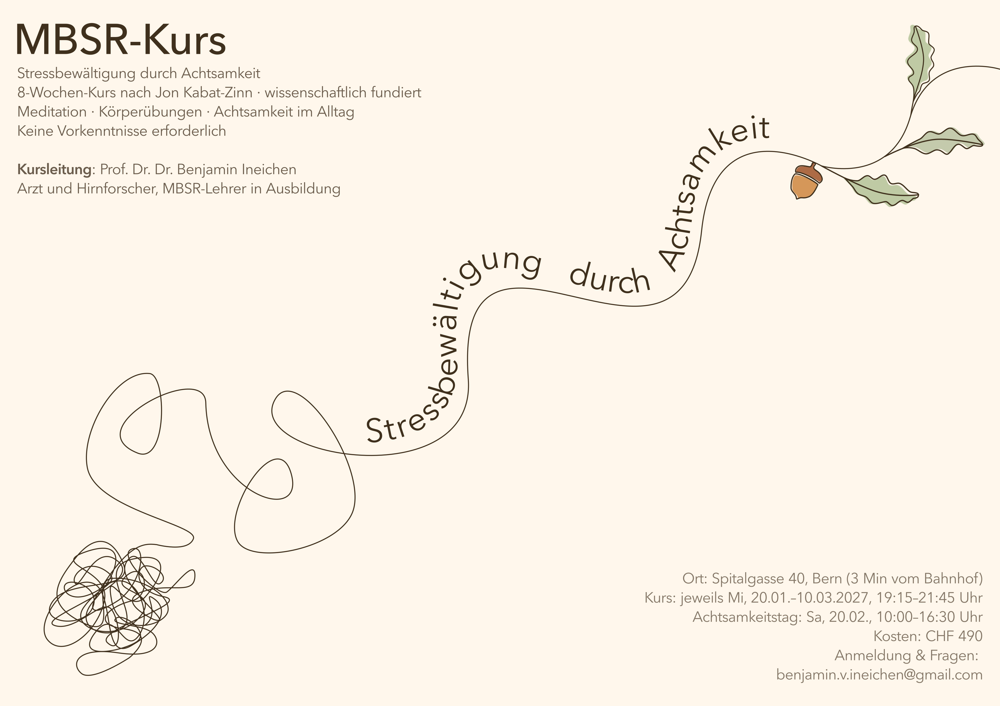

# Meditation

::: {style="text-align: center;"}
*“We can find our true refuge in every moment, in every breath.”*\
— Tara Brach
:::

------------------------------------------------------------------------

Ich unterrichte Meditation und Achtsamkeit, hauptsächlich im Rahmen von MBSR (Mindfulness-Based Stress Reduction). Meine eigene Praxis hat sich über etwa zehn Jahre entwickelt und umfasst mehrere längere Schweigeretreats in verschiedenen Meditationstraditionen, hauptsächlich Zen, aber auch Vipassana und Metta.

Ich habe mit Lehrerinnen und Lehrern wie Vanja Palmers, Amarana, Manfred Hellrigl, Isis Bianzano, Rainer Künzi und Ingeborg Mösching praktiziert. Mein Denken über Meditation, den Geist und das Bewusstsein wurde zudem von Menschen wie Alan Watts, Ram Dass, Albert Hofmann, Culadasa, Robert Macfarlane und John Vervaeke beeinflusst.

Ich bin durch eine zutiefst erschütternde Erfahrung vor etwa zehn Jahren zur Meditation und Achtsamkeit gekommen. Seitdem ist die Meditation geblieben und zu einem festen Bestandteil meines Lebens geworden.

Was mich am meisten fasziniert, ist ganz einfach die Beobachtung dieses erstaunlichen und zugleich etwas bizarren Dings, das wir unseren Geist nennen. Zu beobachten, wie Gedanken und Emotionen auftauchen, oft ohne dass wir auch nur den geringsten Einfluss darauf haben, was als Nächstes kommt. Und hin und wieder einen kleinen Blick hinter die sehr überzeugende Illusion zu erhaschen, dass irgendwo in uns ein zusammenhängendes „Selbst“ existiert, das alles steuert. Stattdessen kann sich ein Gefühl von etwas viel Weiträumigerem zeigen: Gedanken, Gefühle, Körperempfindungen und Wahrnehmungen entstehen und verschwinden innerhalb des Bewusstseins.

Ich finde das sowohl faszinierend als auch hilfreich. Zu erkennen, dass wir tatsächlich die meisten unserer Gedanken und Gefühle nicht bewusst auswählen, kann eine gewisse Distanz zu uns selbst schaffen. Ein Gedanke kann einfach ein Gedanke sein. Eine Emotion kann einfach eine Emotion sein. Nicht mehr und nicht weniger. Wir müssen sie nicht unbedingt für wahr halten, nach ihnen handeln oder sie zu einem Teil unserer Identität machen.

Als Wissenschaftlerin und eher kritisch denkender Mensch stelle ich mir immer wieder diese Frage: Wie hat Meditation mich tatsächlich verändert? Besonders weil ich mich auch nach zehn Jahren noch ganz klar als Anfängerin betrachte.

Heute würde ich sagen: ja, durchaus grundlegend – aber nicht auf spektakuläre Weise. Meditation hat mich nicht in einen anderen Menschen verwandelt, mich nicht dauerhaft ruhig gemacht und auch nicht das übliche Chaos des Menschseins gelöst. Die Veränderung war viel subtiler.

Mit der Zeit hat sich eine kleine, aber spürbare Verschiebung ergeben: weg davon, jedem Gedanken und jeder Emotion zu glauben, die mein Gehirn hervorbringt. Und vielleicht auch hin zu einem etwas offeneren, freundlicheren und mitfühlenderen Umgang mit mir selbst, mit anderen Menschen und mit der Welt. Zumindest manchmal.

Und ich habe das starke Gefühl, dass ich gerade erst ganz am Anfang davon stehe, überhaupt etwas davon zu verstehen...

## Achtsamkeit lernen

MBSR ist ein achtwöchiges Achtsamkeitsprogramm, das Ende der 1970er-Jahre von Jon Kabat-Zinn am University of Massachusetts Medical Center entwickelt wurde und seither sowohl in klinischen als auch in nicht-klinischen Kontexten umfassend untersucht worden ist.

Ich denke, dass MBSR ein guter Ausgangspunkt für Menschen ist, die neugierig auf Meditation und Achtsamkeit sind, aber nicht genau wissen, wo sie anfangen sollen. Es bietet einen strukturierten und weitgehend säkularen Ansatz, der auch für Menschen zugänglich sein kann, die sich für Meditation interessieren, aber eine starke Abneigung gegen alles haben, was allzu spirituell klingt.

Weiter unten findest du die nächsten MBSR-Kurse. Oder melde dich gerne bei mir, wenn du dich für Einzelstunden interessierst.

## Bücher, die mein Denken über Geist, Achtsamkeit, Meditation und Bewusstsein geprägt haben

The Mind Illuminated — *Culadasa (John Yates)*\
How to Change Your Mind — *Michael Pollan*\
DMT: The Spirit Molecule — *Rick Strassman* The Alchemist — *Paulo Coelho*\
Thinking, Fast and Slow — *Daniel Kahneman*\
Noise — *Daniel Kahneman, Olivier Sibony & Cass R. Sunstein*\
Mountains of the Mind — *Robert Macfarlane*\
Hiking Zen — *Phap Xa & Phap Luu*\
The Only Dance There Is — *Ram Dass*\
When Things Fall Apart — *Pema Chödrön*\
Zen Mind, Beginner’s Mind — *Shunryu Suzuki*\
LSD: My Problem Child — *Albert Hofmann*\
Acid Dreams — *Martin A. Lee & Bruce Shlain*\
There Is No Other — *Ram Dass*

------------------------------------------------------------------------

::: {style="text-align: center;"}
*“Everything in life is a win if the goal is to experience.”*\
— Ram Dass

*“The alchemist does not fear losing what has never belonged to them.”*\
— Unknown

*“Life is an exercise in becoming freer of fear.”*\
— Ram Dass

*“Everything that enters my life is a gift. Everything that leaves my life is a gift.”*\
— Unknown

*“With an undefended heart, we can fall in love with life over and over every day. We can become children of wonder, grateful to be walking on Earth, grateful to be part of all of creation.”*\
— Tara Brach

*“The quieter you become, the more you can hear.”*\
— Ram Dass

*“I would like my life to be a statement of love and compassion—and where it isn’t, that’s where my work lies.”*\
— Ram Dass
:::

------------------------------------------------------------------------

{.border-img fig-align="center"}
