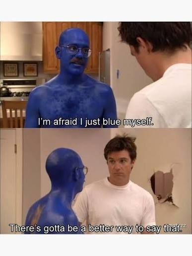
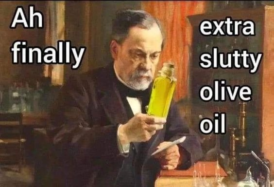

# Fun

  
  

---

*"You miss 100% of the shots you don't take - Wayne Gretzky"*   
— Micheal Scott, Scranton PA

---

  
  

<iframe width="560" height="315" src="https://www.youtube.com/embed/JYqfVE-fykk?si=unW9j2E9qfsxzKEy" title="YouTube video player" frameborder="0" allow="accelerometer; autoplay; clipboard-write; encrypted-media; gyroscope; picture-in-picture; web-share" referrerpolicy="strict-origin-when-cross-origin" allowfullscreen></iframe>

 

  
  

 

  
  

