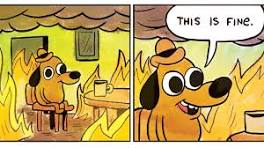
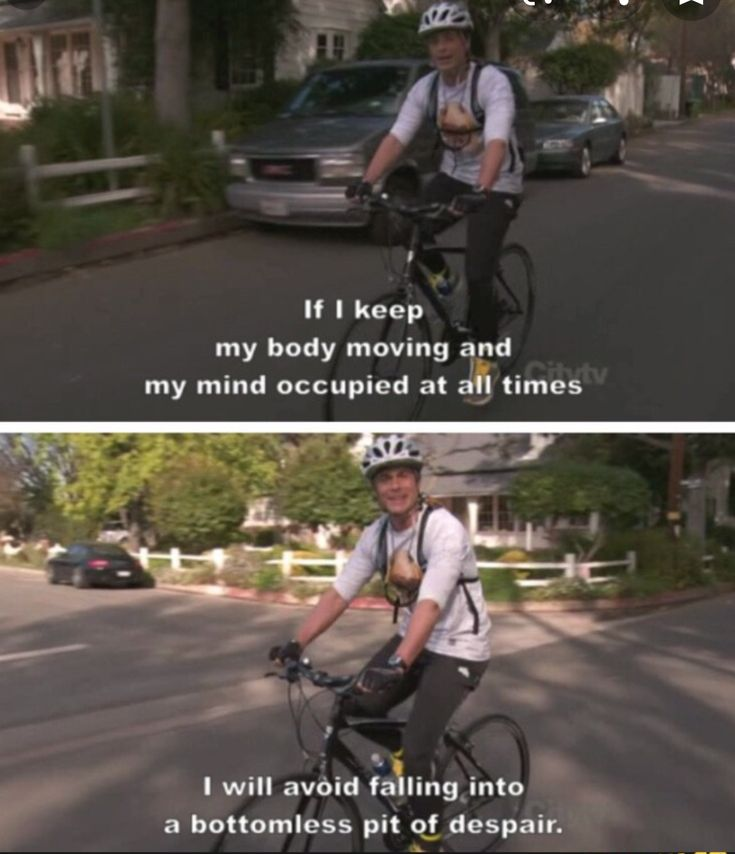
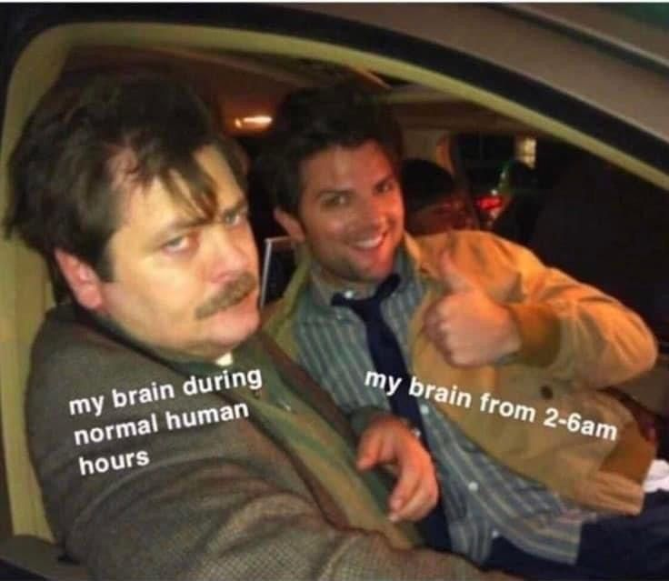
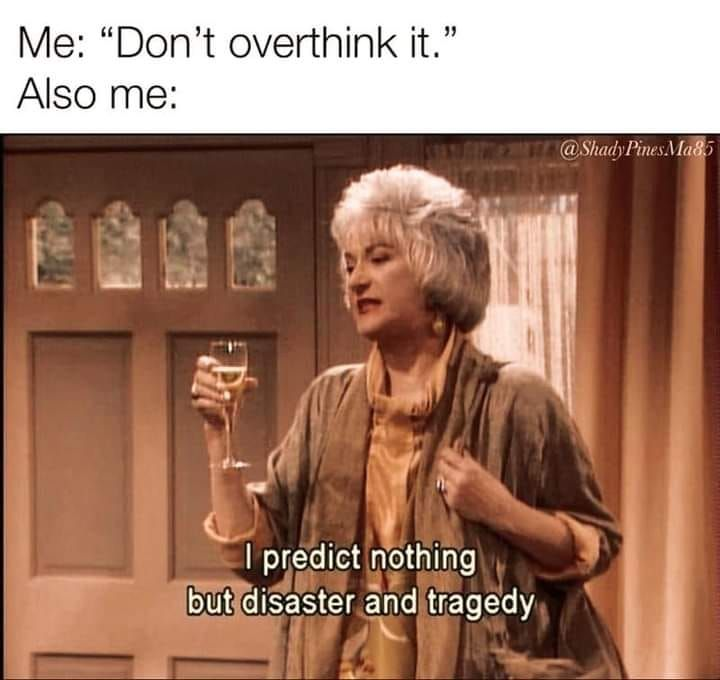
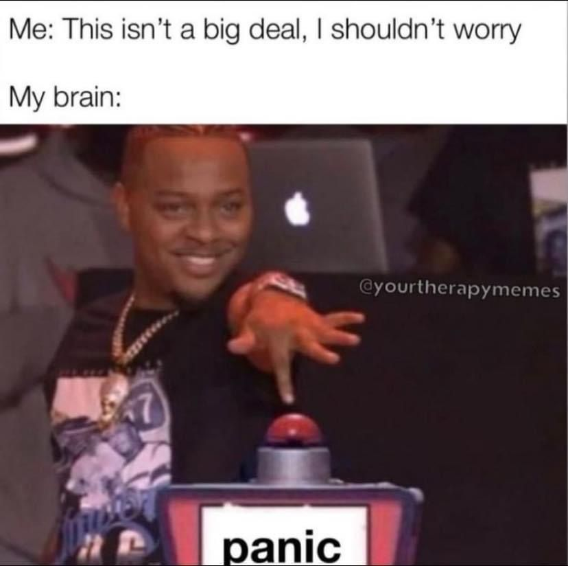
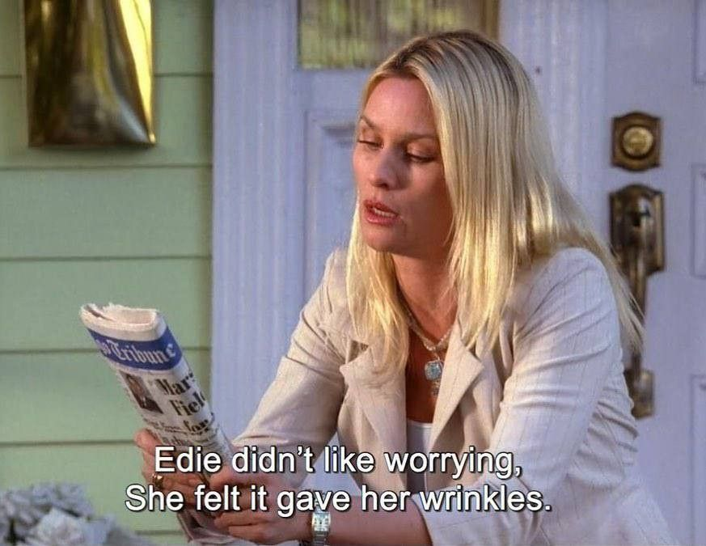

# Fun

  
  

---

*"You miss 100% of the shots you don't take - Wayne Gretzky"*   
— Micheal Scott, Scranton PA

---

  
  

 

  
  

---

*"Treat yo self!"*   
— Tom Havenford and Donna Meagle

---

  
  

 

  
  

---

*"It's fine! The doctor said all my bleeding was internal. That's where the blood's supposed to be."*   
— Jake Peralta

---

  
  

